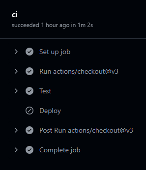
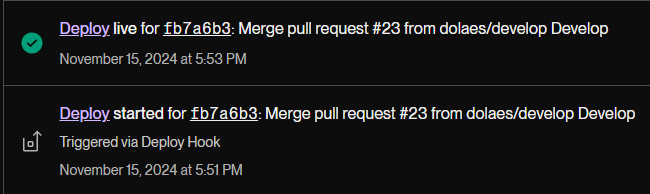

# GitHub Actions CI/CD

## Description

This project is a tech quiz that asks the user 10 random questions to test their knowledge. After completing the quiz, the user has the option to retake it with a new set of questions. The goal of this project was to deploy this project to Render. In addition, the goal was also to create a CI/CD pipeline using GitHub Actions to run the component tests via Cypress when a Pull Request is made to the develop branch, and the application is deployed when code is merged from develop to the main branch.

## Table of Contents

- [Installation](#installation)
- [Usage](#usage)
- [Contributing](#contributing)
- [Testing](#testing)
- [Links](#links)

## Installation

To get started with this application, follow these steps:

1. **Visit the Deployed Website**  
   Click here to visit the [Deployed Website](https://github-actions-ci-cd-qdwg.onrender.com)

## Usage

After landing on the website, you can take the quiz.

## Contributing

Developed by:  
- Daniel Olaes

Starter code provided by UCI Software Engineering Boot Camp.

## Testing

For testing, small changes were made in the develop branch. For example, a "?" was added to the "Start Quiz" button at the beginning of the quiz. After pushing the change to GitHub and creating a pull request, a CI/CD pipeline using GitHub Actions activates to perform component testing. After the test passes and the merge is confirm, the new change is automatically deployed to Render.

## Links

- **GitHub Repository**: [https://github.com/dolaes/GitHub-Actions-CI-CD](https://github.com/dolaes/GitHub-Actions-CI-CD)
- **Render Deployment**: [https://github-actions-ci-cd-qdwg.onrender.com](https://github-actions-ci-cd-qdwg.onrender.com)
